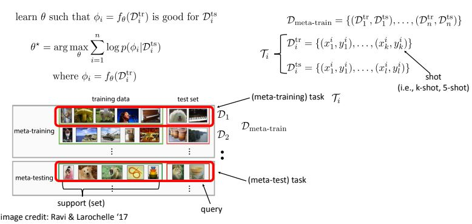

# Meta Learning (Technion ECE 046211 project)

<a href="https://github.com/lioritan">Lior Friedman</a> •
<a href="https://github.com/ynahum">Yair Nahum</a> 

- [Meta Learning](#Meta Learning 046211 project)
  * [Introduction](#intorduction)
  * [Setup](#setup)
    
## Intorduction
<a href="https://www.youtube.com/watch?v=ByeRnmHJ-uk">Tutorial on YouYube</a>
## Setup
TODO