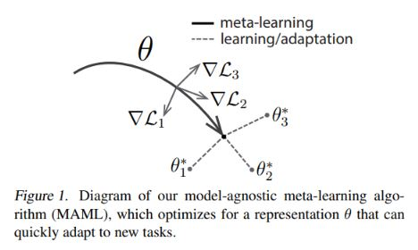

# Meta Learning Technion ECE 046211 project

<a href="https://github.com/lioritan">Lior Friedman</a> •
<a href="https://github.com/ynahum">Yair Nahum</a> 

- [Meta Learning](#meta-learning-technion-ece-046211-project)
  * [Goal](#goal)
  * [Introduction](#introduction)
  * [Setup](#setup)
  * [Run](#run)
    
## Goal

Investigate different orders of data tasks loading on the MAML meta learning algorithm.  

## Introduction

Meta learning is basically learning to learn fast based on experience using 
small amount of data (few shots). It has applications in robotics (RL), classification and regression (SL).  
The SOTA MAML algorithm main idea is to learn meta parameters and get to
good point in space such that, when finetuning/adapting on a new task, we will learn fast a good optimal point with
a good test accuracy.

Some sources to get started on meta learning and MAML in specific:  
<a href="https://www.youtube.com/watch?v=ByeRnmHJ-uk">A short tutorial of MAML algorithms writers</a>    
<a href="http://proceedings.mlr.press/v70/finn17a">The MAML paper</a>

A great opened course lectures on youtube:  
<a href="https://www.youtube.com/playlist?list=PLoROMvodv4rMC6zfYmnD7UG3LVvwaITY5">Stanford CS330 course on Multi-Task and Meta-Learning</a>  

## Setup

We've used pytorch and the learn2learn library as the base for our implmenetation and research. 
Just clone the repo as any other and you're ready to go.  

## Run
In order to run the code, you can use the direct main.py file with its arguments 
(see the args in code)  
Or   
You can open the jupyter notebook (was run on google colab due to GPU needs).
Grid search comperative experiments were run using wandb (weights & biases) sweeps. 

